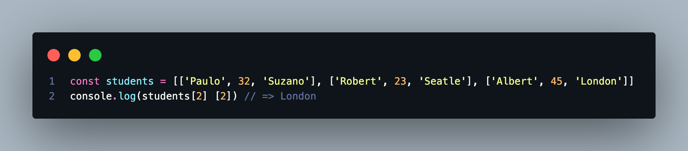
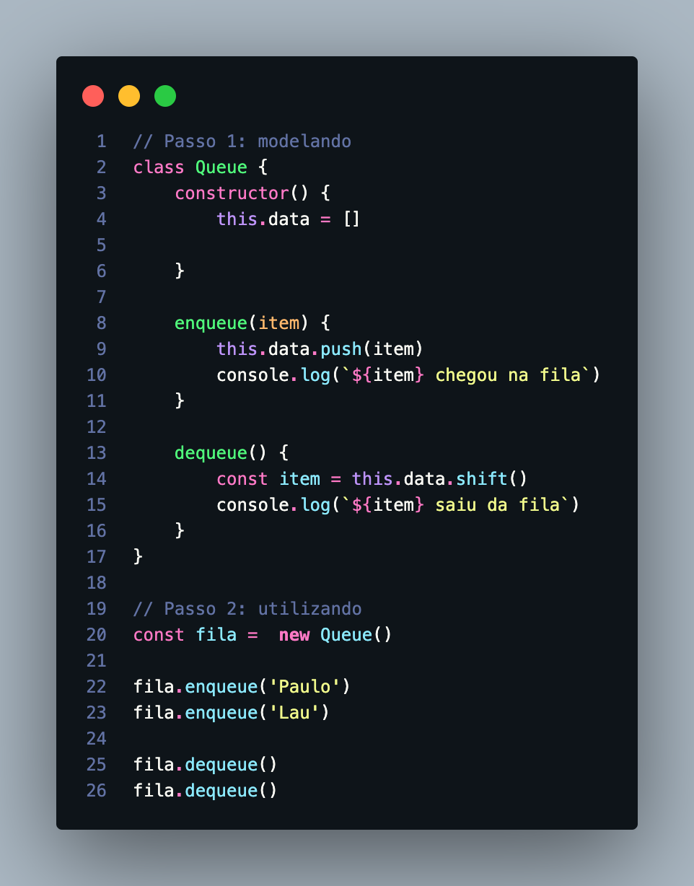

# Estrutura de Dados com javascript

- linguagem da web
- linguagem de alto nível
- foco no entendimento e não na construção

//Array
[1, 2, 3] elementos 1, 2 e 3

// Object
{name: 'Paulo', age: 32}  elementos (propriedade "key/chave" e valor)

## Gerenciamento de Dados

> Estrutura de dados tem a ver com a gestão das informações da aplicação

`Para esse gerenciamento, podemos dividir em três etapas`

- Modelar a estrutura
- Dar vida a estrutura
- Criar as funcionalidades dessa estrutura
exemplo: inserir, excluir, buscar, exibir...etc

## Arrays

Array, vetor ou arranjo.É uma estrutura amplamente utlizada e implementada em quase todas as linguagens de programação

- básica e simples de criar e utilizar

### Características

- acesso pelo index
- Respeita a ordem de incersão pelos elementos
- Aceita valores duplicados

> Arrays no javascript

*São dinâmicos
*Você poderá ter dados de diferentes tipos misturados dentro de um Array Strings, numbers, booleans, objetos, funções e até outros arrays
*existem muitos métodos já implementados
  *`push(), pop(), find(), filter()` entre outros

### Matriz

Matriz ou Vetor Multidimensional

`Significa que é um array dentro de outro array`

## Queue

Tradução de Queue é fila.Como uma fila em uma loja ou restaurante

- linear
- o primeiro a entrar na fila é o primeiro a sair

### Conceitos

`FIFO: First in First out`

- o primeiro elemento a entrar na fila é o primeiro a sair dela

> Front (frente) é a referência do primeiro elemento a entrar na fila
> Back (fundo) é a referência do último elemento a entar da fila

#### Métodos fundamentais

- `enqueue()` adicionar um elemento ao final da fila
- `dequeue()` remover o primeiro elemento a entrar na fila

