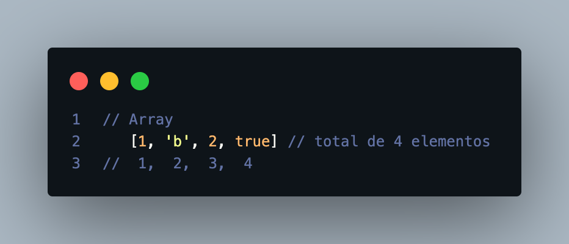

# Estrutura de Dados com javascript

- linguagem da web
- linguagem de alto nível
- foco no entendimento e não na construção

//Array
[1, 2, 3] elementos 1, 2 e 3

// Object
{name: 'Paulo', age: 32}  elementos (propriedade "key/chave" e valor)

## Gerenciamento de Dados

> Estrutura de dados tem a ver com a gestão das informações da aplicação

`Para esse gerenciamento, podemos dividir em três etapas`

- Modelar a estrutura
- Dar vida a estrutura
- Criar as funcionalidades dessa estrutura
exemplo: inserir, excluir, buscar, exibir...etc

## Arrays

Array, vetor ou arranjo.É uma estrutura amplamento utlizada e implementada em quase todas as linguagens de programação

- básica e simples de criar e utilizar

